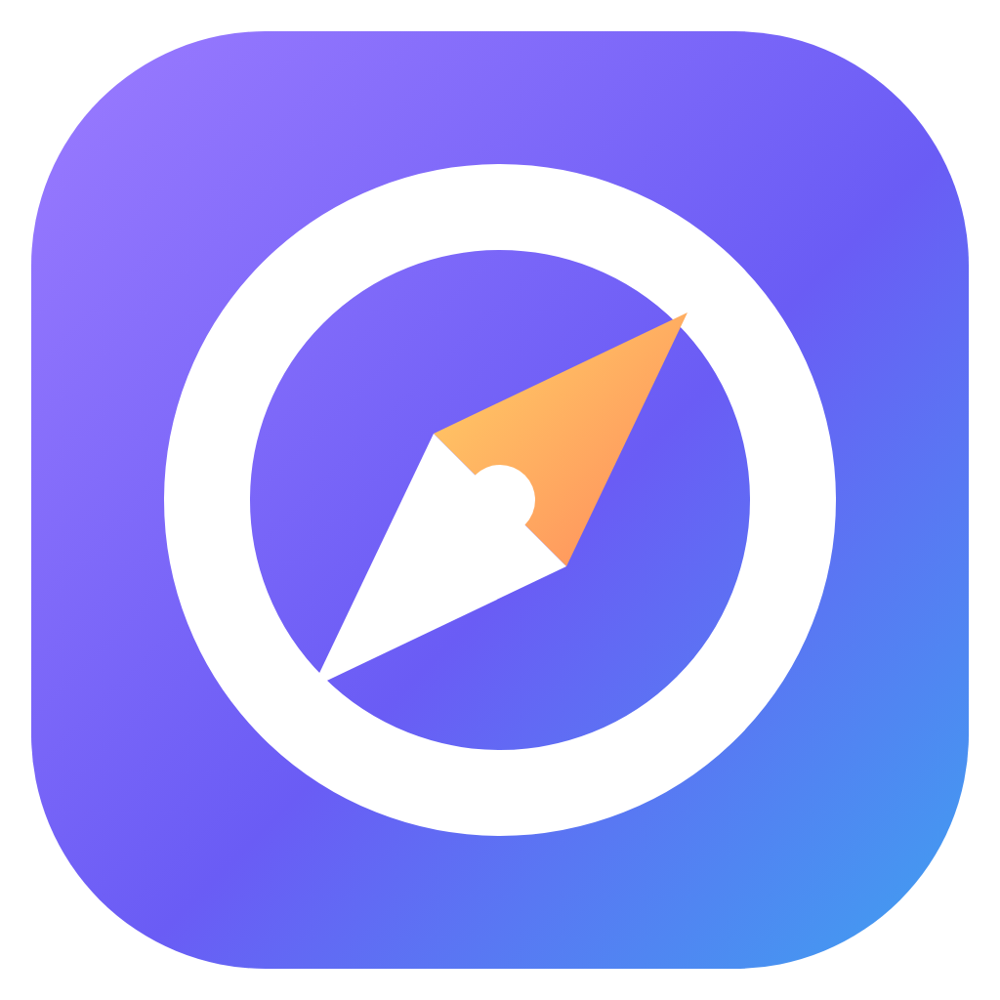

# Odonavig

Odonavig est un navigateur web pour **Windows 10 et Windows 11** (64 bits), pensé pour être **ultra simple**. Son style s’inspire d’[Arc](https://arc.net/) (couleurs douces, formes arrondies), avec une disposition classique : les **onglets en haut**, l’adresse juste en dessous, puis la barre des favoris.



## Fonctionnalités

| | |
|---|---|
| 🌐 **Navigation** | Adresse ou recherche Google dans la même case, précédent / suivant / actualiser |
| 🗂️ **Onglets** | Onglets en haut de la fenêtre, glisser pour les réordonner, clic molette pour fermer, rouvrir un onglet fermé, onglets restaurés au prochain lancement |
| ⭐ **Favoris** | Une étoile pour ajouter ou retirer, barre des favoris sous l’adresse et sur la page d’accueil, clic droit pour renommer ou retirer |
| 🔍 **Zoom** | Boutons − / + / 100 %, `Ctrl` + `+`/`-`/`0` ou `Ctrl` + molette |
| ⛶ **Plein écran** | Bouton ou `F11` (Échap pour quitter). Passez la souris en haut de l’écran pour faire réapparaître les onglets |
| 📄 **PDF** | Lecteur PDF intégré (zoom, rotation, impression, miniatures) |
| 🖼️ **Images** | PNG, JPEG, GIF, WebP, AVIF, BMP, SVG, ICO et **TIFF** dans une visionneuse (zoom à la molette, déplacement, rotation, pages TIFF) |
| 📂 **Ouvrir un fichier** | Bouton dossier, `Ctrl` + `O`, glisser-déposer, ou « Ouvrir avec… Odonavig » dans Windows |
| 🎨 **Couleurs** | 5 thèmes : Lavande, Ciel, Menthe, Pêche et Nuit (sombre) |
| ➕ **Et aussi** | Recherche dans la page (`Ctrl` + `F`), impression (`Ctrl` + `P`), téléchargements, menu clic droit en français |

## Raccourcis clavier

| Raccourci | Action |
|---|---|
| `Ctrl` + `T` | Nouvel onglet |
| `Ctrl` + `W` | Fermer l’onglet |
| `Ctrl` + `Maj` + `T` | Rouvrir l’onglet fermé |
| `Ctrl` + `Tab` / `Ctrl` + `1…9` | Changer d’onglet |
| `Ctrl` + `L` | Écrire une adresse |
| `Ctrl` + `D` | Ajouter / retirer des favoris |
| `Ctrl` + `+` / `-` / `0` | Zoomer / dézoomer / 100 % |
| `F11` | Plein écran |
| `Ctrl` + `Maj` + `B` | Masquer / afficher la barre des favoris |
| `Ctrl` + `O` | Ouvrir un PDF ou une image |
| `Ctrl` + `F` | Rechercher dans la page |
| `Ctrl` + `P` | Imprimer |
| `Alt` + `←` / `→` | Précédent / suivant |

## Récupérer le fichier .exe

GitHub Actions construit automatiquement Odonavig pour Windows à chaque envoi de code :

1. Ouvrez l’onglet **Actions** du dépôt sur GitHub.
2. Cliquez sur la dernière exécution de **Construire Odonavig (.exe)**.
3. En bas de la page, téléchargez l’archive **Odonavig-Windows**. Elle contient :
   - `Odonavig-Setup-1.0.0.exe` : l’installateur (raccourcis sur le Bureau et dans le menu Démarrer) ;
   - `Odonavig-Portable-1.0.0.exe` : la version portable, qui se lance sans installation.

Pour publier une version téléchargeable depuis l’onglet **Releases**, créez un tag qui commence par `v` (par exemple `v1.0.0`).

### Compatibilité Windows 11

- Odonavig fonctionne sous Windows 10 et Windows 11, en 64 bits (x64). Sur les PC Windows 11 à processeur ARM, la version x64 tourne grâce à l’émulation intégrée à Windows.
- Les boutons réduire / agrandir / fermer sont ceux de Windows 11, et la fenêtre garde ses coins arrondis et le Snap Layouts.
- À chaque construction, GitHub Actions lance le .exe sous Windows et vérifie que le navigateur démarre.
- L’application s’installe pour l’utilisateur courant, sans droits administrateur.

> Windows SmartScreen peut afficher un avertissement au premier lancement, car l’application n’est pas signée. Cliquez sur **Informations complémentaires**, puis sur **Exécuter quand même**.

## Développement

Prérequis : [Node.js](https://nodejs.org/) 20 ou plus récent.

```bash
npm install        # installe les dépendances
npm start          # lance Odonavig
npm run dist       # construit l’installateur et la version portable (sous Windows)
```

Sous Linux ou macOS, `npx electron-builder --win portable` construit la version portable. L’installateur NSIS demande Wine.

### Organisation du code

```
src/
  main.js            processus principal : fenêtre, raccourcis, menu clic droit, téléchargements, stockage
  preload.js         pont sécurisé entre l’interface et le processus principal
  renderer/          interface : onglets, barre d’adresse, favoris, zoom, page d’accueil
  viewer/            visionneuse d’images (dont TIFF)
  assets/icon.png    icône de l’application
build/icon.png       icône utilisée pour le .exe
```

Odonavig repose sur [Electron](https://www.electronjs.org/), qui embarque Chromium. Les pages web s’affichent donc comme dans Chrome ou Edge, et le lecteur PDF est celui de Chromium.

Les favoris, les onglets ouverts et les réglages sont enregistrés dans `%APPDATA%\Odonavig\odonavig-data.json`.
